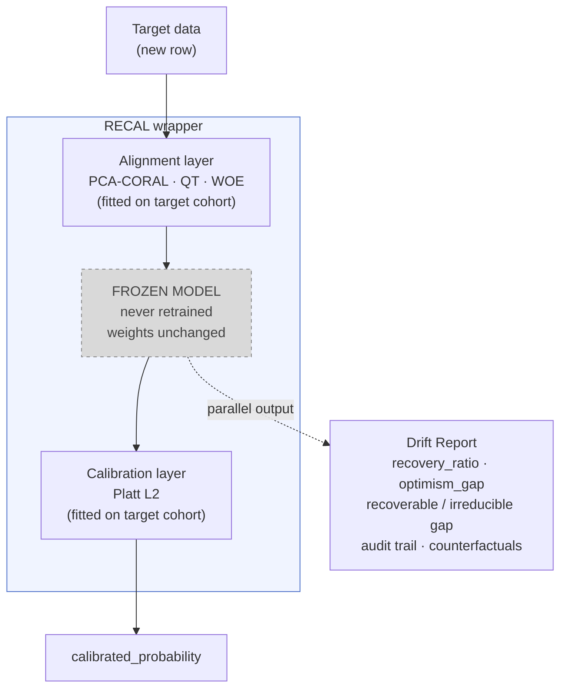

# RECAL — Recalibration & Alignment Wrapper

[](https://github.com/ramsestein/RECAL/actions/workflows/ci.yml)
[](LICENSE)
[](pyproject.toml)

**Recalibrate and align frozen binary predictive models across clinical domains without retraining.**

Wrap a frozen binary predictive model (XGBoost / sklearn / Keras / PyTorch / BYOM)
so it works on a new target domain — and produce an honest report that tells
you whether the wrapper is enough or you need to retrain.

---

## What problem this solves

A collaborator shares a model developed at hospital A. The model performs well
in its original population, but when deployed at hospital B it fails: covariate
distributions shift, prevalence changes, monitoring practices differ, and
missingness patterns no longer match the training environment.

The practical problem is usually twofold:

1. **You do not have enough local data to properly retrain the model.**  
   You may have enough data to audit and evaluate performance degradation, but
   not enough to develop and validate a fully new model with confidence.

2. **The original model collapses in your population.**  
   In many real-world settings, naïvely deploying the external model is simply
   unsafe. If large-scale local training data were available, it would often be
   preferable to train a local model directly rather than attempting marginal
   fine-tuning of the imported one.

RECAL is designed specifically for this scenario.

Instead of modifying the original model weights, RECAL places an auditable and
interpretable wrapper around the frozen model. RECAL's alignment layer uses
feature-based transformations (e.g. PCA-CORAL) that also appear in existing
domain-adaptation toolboxes such as the *ADAPT* library (de Mathelin *et al.*,
2021). The key difference is not the algorithmic family — it is the **workflow
constraint and the decision artefact**:

1. **Frozen-model constraint.** RECAL treats the model as a black box and never
   requires the original training data. You only need a small labelled validation
   cohort from the target domain.

2. **Decision artefact.** ADAPT is a collection of ~30 algorithms; it does not
   tell you *whether* to deploy the adapted model. RECAL computes an **honest
   optimism gap** (in-sample vs. cross-validated out-of-fold) and a
   **recoverable/irreducible gap decomposition** (against a target-trained oracle
   ceiling), producing a verifiable verdict: *deploy the wrapper* or *retrain*.

In short: RECAL is not a replacement for domain-adaptation algorithms; it is a
**wrapper and audit layer** that uses some of the same algorithmic building
blocks but adds the missing link — a principled decision on whether the wrapper
is sufficient.

The framework first performs a
structured data audit to identify *why* the model fails in the target
population: which variables drift, whether the drift is clinically meaningful
or merely acquisition-related, and which differences represent true population
variation versus spurious dataset effects.

Based on this audit, RECAL applies controlled transformations around the model
(input alignment, feature harmonization, calibration, and distribution-aware
corrections) to determine whether the observed degradation can be recovered
without retraining.

Importantly, the objective is **not** to erase all drift. Some differences
between populations are real and should remain. The goal is to isolate and
correct the *recoverable* component of the drift — the part caused by
measurement practices, missingness mechanisms, preprocessing mismatches, or
other non-physiological biases — while preserving genuine clinical differences
between populations.

The final outcome is not just a corrected prediction pipeline, but a quantified
decision:

- **Recoverable drift:** the wrapper successfully restores acceptable
  performance, suggesting that the external model remains transferable after
  alignment.

- **Structural drift:** performance cannot be recovered without substantial
  adaptation, indicating that the target population is fundamentally different
  and that local retraining or redesign is necessary.

---

## How it works



The dashed border on **FROZEN MODEL** is intentional: the wrapper wraps
around it but never reaches inside.  For the full design with fit-time and
inference-time diagrams see [docs/ARCHITECTURE.md](docs/ARCHITECTURE.md).

---

## Quick start

```bash
# 1. Install from GitHub (no clone needed)
pip install git+https://github.com/ramsestein/RECAL.git

# Or clone and install in editable mode for development
pip install -e ".[dev]"

# 2. Prepare inputs
#   inputs/models/your_model.json   — frozen model (XGB / sklearn / Keras / torch / BYOM)
#   inputs/source/source.csv       — source cohort (for distribution alignment)
#   inputs/target/target.csv       — target validation cohort (must have labels)
#   inputs/feature_schema.json     — ordered list of feature names

# 3. Copy the example config and edit paths
cp configs/example_snuh_to_clinic.yaml configs/my_run.yaml

# 4. Run
recal --config configs/my_run.yaml
# or equivalently:
python -m recal_cli.run --config configs/my_run.yaml

# Faster iteration (skip oracle + attribution)
recal --config configs/my_run.yaml --skip-expensive

# Override a single parameter without editing the YAML
recal --config configs/my_run.yaml --override recal_core.pca_k=8
```

For the full walkthrough — including how to interpret every section of the
report — see [docs/USAGE.md](docs/USAGE.md).

---

## What you get

| Output | Description |
|--------|-------------|
| `outputs/recal_models/<run_id>_<ts>.joblib` | Callable wrapper — load with `joblib.load()` and call `.predict_proba(X_target)` for production inference |
| `outputs/reports/<run_id>_<ts>.html` | Self-contained HTML report with all sections: drift, attribution, audit trail, calibration decomposition, counterfactuals |
| `outputs/audit/<run_id>.yaml` | SHA-256 hashes of every input, full config, designer decisions, dependency versions — for exact reproducibility |

Output file names include a `_YYYYMMDD_HHMMSS` timestamp by default (`output.timestamp: true` in the config) so that successive runs never overwrite each other.  Set `timestamp: false` for fixed, predictable names.

---

## Decision boundaries

Use these two metrics first when reading the report:

| Metric | Value | Interpretation | Action |
|--------|-------|----------------|--------|
| `optimism_gap` | < 0.02 | Robust | Deploy wrapper with confidence |
| `optimism_gap` | 0.02 – 0.05 | Moderate | Increase `n_target` or reduce `max_n_sweep` |
| `optimism_gap` | > 0.05 | Suspicious | Do not deploy; collect more target data |
| `recovery_ratio` | > 0.7 | Distributional drift | Wrapper sufficient |
| `recovery_ratio` | 0.3 – 0.7 | Mixed drift | Wrapper useful; evaluate retraining |
| `recovery_ratio` | < 0.3 | Structural drift | Retrain |

Full table (including joint drift and Brier decomposition signals) in
[docs/ARCHITECTURE.md — Decision boundaries](docs/ARCHITECTURE.md#decision-boundaries).

---

## Repository layout

```
recal_cli/            Public CLI package
  ├── model_loader.py         Loads XGB / sklearn / keras / torch / BYOM
  ├── data_loader.py          CSV/parquet → CohortPair
  ├── config_schema.py        YAML validation (all parameters documented)
  ├── pipeline_preprocessor.py  Applies *_pipeline.json before schema alignment
  ├── cross_validate.py       Honest k-fold (optimism gap)
  ├── drift_compute.py        Per-feature drift decomposition (six-category taxonomy)
  ├── joint_drift.py          VIF / condition number / effective rank analysis
  ├── drift_attribution.py    Recoverable vs irreducible gap with DeLong CIs
  ├── counterfactuals.py      Alternative config sweep
  ├── oracle.py               Target oracle (k-fold ceiling)
  └── run.py                  End-to-end orchestrator

recal_core/           Internals (profiler, designer, pipeline, reporter)
recal/                Alignment algorithms (PCA-CORAL, QT, WOE, calibration)

configs/              Your YAML run configurations
inputs/               Your models, datasets and feature schema
outputs/              Reports + serialised wrappers + drift cache
docs/                 Extended documentation
tests/                Regression tests
```

---

## Supported model formats

| Extension | Backend | Notes |
|---|---|---|
| `.json` `.ubj` `.bin` | XGBoost | Native NaN handling. Recommended. |
| `.joblib` `.pkl` | sklearn / `.predict_proba()` | |
| `.h5` `.keras` | Keras / TensorFlow | NaNs imputed to 0. |
| `.pt` `.pth` | PyTorch (`torch.save(model)`) | Full model required, not state_dict. |
| **BYOM** | Anything | Your `.py` with `def load_model(path):` |

See [docs/MODEL_FORMAT.md](docs/MODEL_FORMAT.md) for full details and examples.

---

## Limitations

- Binary outcomes only (label ∈ {0, 1}).
- Numeric features only — encode categoricals upstream.
- The wrapper does **not** fix structural drift (changed feature–outcome
  relationships); only retraining can.
- Requires outcome labels in the target cohort (validation, not blind inference).

---

## Documentation

| Document | Contents |
|---|---|
| [docs/ARCHITECTURE.md](docs/ARCHITECTURE.md) | Mental model, 3 Mermaid diagrams, anatomy of outputs, decision boundaries |
| [docs/USAGE.md](docs/USAGE.md) | End-to-end walkthrough: setup → config → run → interpret → infer → reproduce |
| [docs/MODEL_FORMAT.md](docs/MODEL_FORMAT.md) | All supported backends, saving instructions, BYOM skeleton |
| [docs/OVERFITTING.md](docs/OVERFITTING.md) | Optimism gap: definition, thresholds, mitigation strategies |
| [docs/DRIFT_REPORT.md](docs/DRIFT_REPORT.md) | Every metric in the report: definition, formula, thresholds |
| [docs/TESTING.md](docs/TESTING.md) | Test suite overview, running instructions, synthetic vs real data |
| [docs/CHANGELOG.md](docs/CHANGELOG.md) | Version history and notable changes |
| [docs/CONTRIBUTING.md](docs/CONTRIBUTING.md) | Guidelines for contributors |
| [docs/OPEN_QUESTIONS.md](docs/OPEN_QUESTIONS.md) | Known issues and research questions for future versions |

---

## Citation

If you use RECAL in your work, please cite:

```bibtex
@software{marrero_garcia_recal_2026,
  author  = {Marrero García, Ramses},
  title   = {RECAL — Recalibration & Alignment Wrapper},
  year    = {2026},
  version = {0.2.0},
  license = {MIT}
}
```

See [CITATION.cff](CITATION.cff) for the full citation metadata.

---

