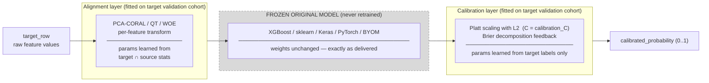
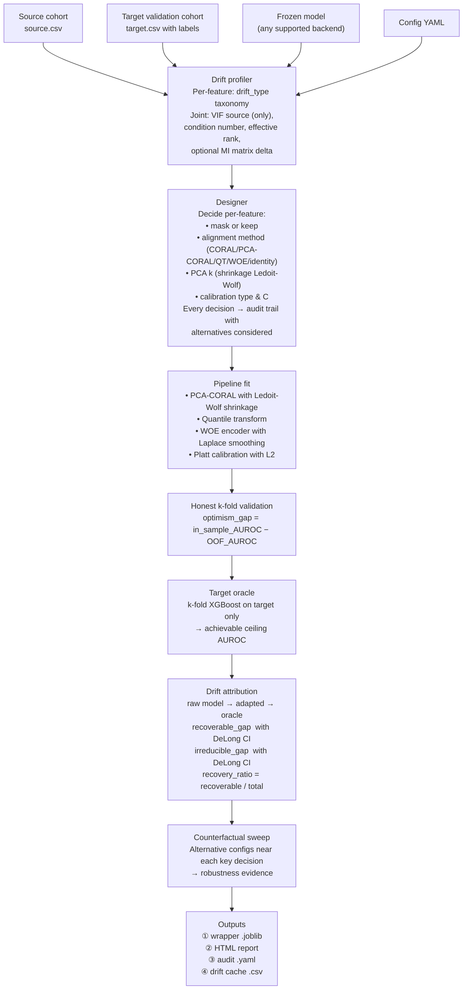
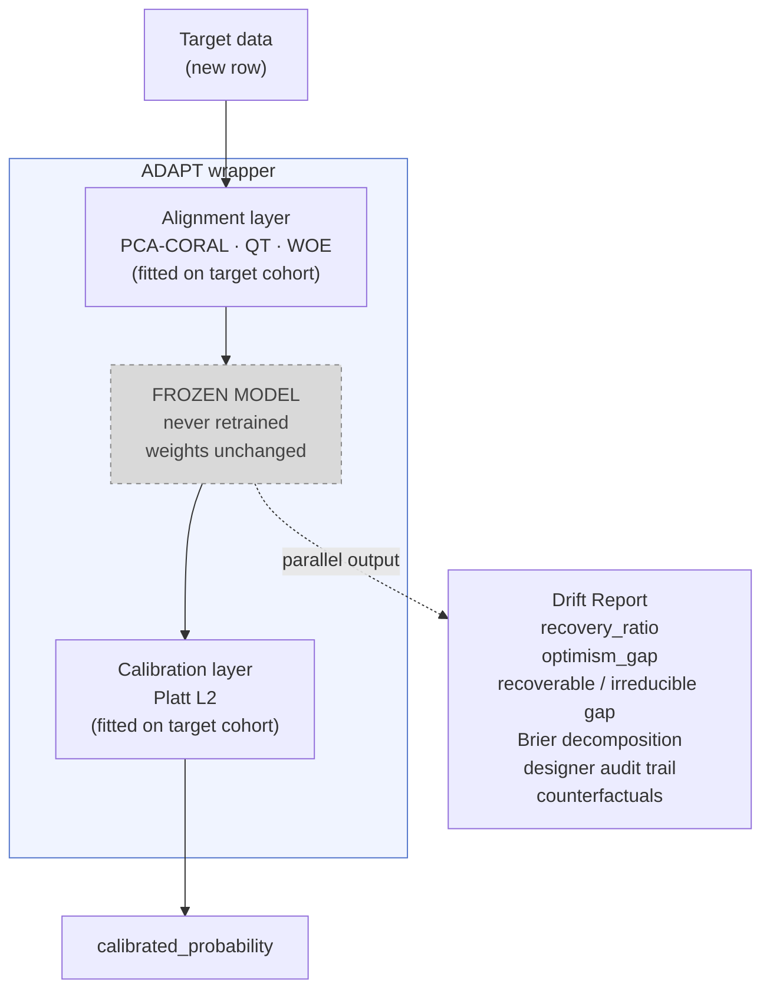

# ADAPT — Architecture

> **Quick orientation:** three diagrams, one table.
> Read the mental model (2 min) → skim the diagrams (3 min) → done.

---

## Mental model

**The original model is frozen and never retrained.**
Its weights, thresholds, and internal structure remain exactly as delivered by
the collaborator. ADAPT does not have access to the model's training set. The
source cohort is used only to characterise the distribution that the model
already expects.

**The wrapper is a double layer *around* the model — not inside it.**
Before the model sees any data, an *alignment layer* transforms each input row
from target-domain statistics into source-domain statistics (PCA-CORAL,
quantile transform, or WOE encoding, depending on what the designer selected
per feature). After the model produces its raw output, a *calibration layer*
re-maps the raw log-odds to calibrated probabilities that are reliable in the
target domain (Platt scaling with L2 regularisation and Brier decomposition
feedback). Nothing in the model itself is touched.

**The wrapper also produces an honest drift report that guides the
retraining decision.**
Alignment and calibration can recover *distributional* drift (covariate shift,
prevalence shift, miscalibration). They cannot recover *structural* drift
(different feature–outcome relationships). The report decomposes the
performance gap into a recoverable fraction and an irreducible residual with
confidence intervals, and flags when the irreducible residual is large enough
that retraining is the only viable path.

---

## Diagram 1 — Inference flow (using the already-built wrapper)

**What is learned from the target validation cohort:**
- Alignment: feature-wise mean/covariance shift (CORAL), empirical quantile
  mapping (QT), or event-rate bins (WOE).
- Calibration: intercept + slope of Platt sigmoid fitted to target labels.

**What comes unchanged from the original model:**
- All internal weights, split thresholds, and feature importance rankings.

---

## Diagram 2 — Fit / Construction flow (building the wrapper)

---

## Diagram 3 — Relationship with the original model

The dashed border on **FROZEN MODEL** is intentional: the wrapper wraps around
it but never reaches inside.  The drift report is a side output produced during
fit — it does not affect inference at all.

---

## Anatomy of the final wrapper

Each run produces four artefacts:

### `outputs/adapted_models/<run_id>.joblib`

A serialised `AdaptedModelWrapper` object (via `joblib`).  Calling
`.predict_proba(X_target)` on it passes rows through the alignment layer,
through the frozen model, and through the calibration layer in one step.
This is the only artefact you need for production inference over **new
data from the same target domain**.

### `outputs/reports/<run_id>.html`

A self-contained HTML file (all CSS and JS inlined, no external dependencies).
Sections:

- Executive summary — `recovery_ratio`, `optimism_gap`, green/amber/red verdict.
- Per-feature drift — drift taxonomy, SHAP importance, alignment method chosen.
- Joint drift — VIF source (target omitted: small cohort makes OLS singular), condition number, effective rank.
- Drift attribution with oracle — raw / adapted / oracle AUROC, recoverable /
  irreducible gap with 95 % DeLong CIs.
- Designer audit trail — every decision with the alternatives considered.
- Counterfactuals — performance under nearby alternative configs.
- Calibration decomposition — Brier reliability / resolution / uncertainty.
- Per-feature log — raw drift stats for every feature in the schema.

### `outputs/audit/<run_id>.yaml`

Machine-readable audit trail containing:

- SHA-256 hashes of every input file (model, source CSV, target CSV, schema).
- Full `FullConfig` dump (all parameters, including defaults).
- Designer decision log with alternatives and selection rationale.
- Per-feature alignment method assigned and reason.
- Versions of critical dependencies (`xgboost`, `scikit-learn`, `scipy`, etc.).

Use this file to reproduce any run exactly (`--audit-replay` flag, planned).

### `outputs/cache/drift_decomposition.csv`

Per-feature drift decomposition cache (LASSO + XGBoost taxonomy, six
categories).  Computing it for ~100 features takes 2–3 minutes; subsequent
runs reuse it instantly.  Delete the file to force recomputation.

---

## Decision boundaries

Operational table for interpreting report metrics.  See [DRIFT_REPORT.md](DRIFT_REPORT.md)
for metric definitions and [OVERFITTING.md](OVERFITTING.md) for the optimism
gap in depth.

| Metric | Value | Interpretation | Suggested action |
|--------|-------|----------------|------------------|
| `optimism_gap` | < 0.02 | Robust | Deploy wrapper with confidence |
| `optimism_gap` | 0.02 – 0.05 | Moderate overfitting | Increase `n_target` or reduce `max_n_sweep` |
| `optimism_gap` | > 0.05 | Suspicious | Do not deploy; collect more target data |
| `recovery_ratio` | > 0.7 | Distributional drift dominates | Wrapper sufficient |
| `recovery_ratio` | 0.3 – 0.7 | Mixed drift | Wrapper useful; evaluate retraining |
| `recovery_ratio` | < 0.3 | Structural drift dominates | Retrain |
| % features with VIF source > `delta_vif_severe` threshold | > 20 % | High multicollinearity in source | Review feature redundancy; consider dimensionality reduction |
| Brier decomp: Δ Reliability (source → target) | large positive | Source miscalibration | Wrapper resolves this well |
| Brier decomp: Δ Resolution (source → target) | negative | Discrimination loss | Retrain (alignment does not recover this) |

---

*For the end-to-end walkthrough see [USAGE.md](USAGE.md).
For metric definitions see [DRIFT_REPORT.md](DRIFT_REPORT.md).*
